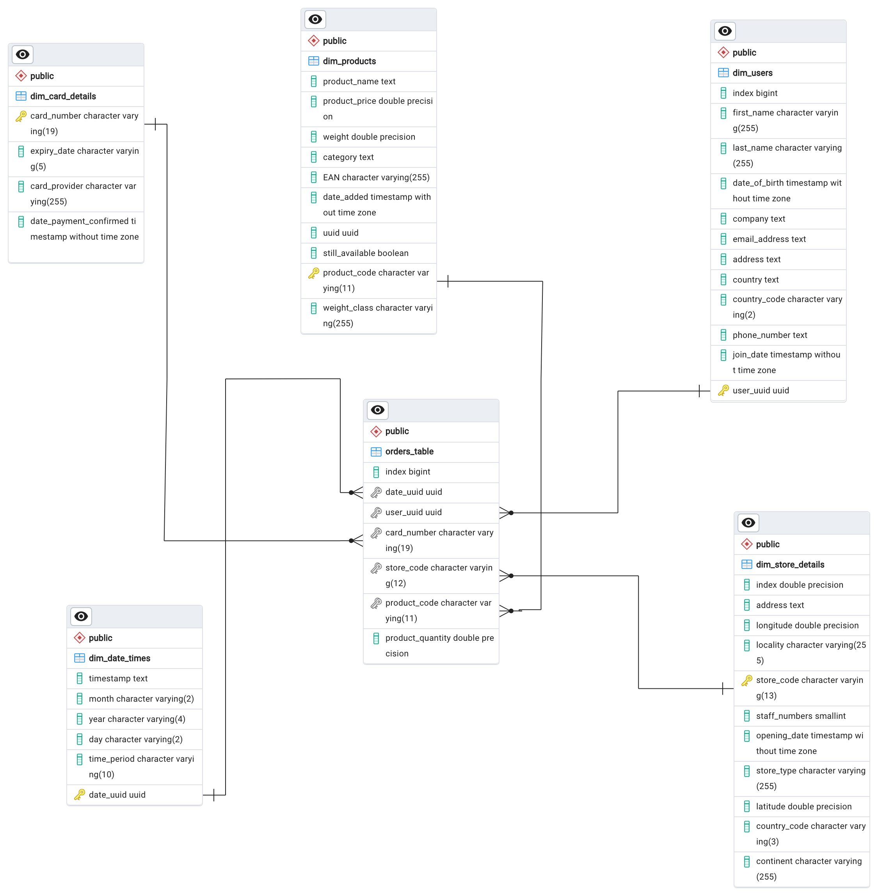

# Multinational Retail Data Centralisation

Project Description

    Main Technologies Used

Data Cleaning
Entity Relationship Diagram (ERD)
Data Analysis
Installation Instructions
File Structure of the Project
License Information

## Table of Contents
1. [Project Description](#project-description)
    - [Main Technologies Used](#main-technologies-used)
2. [Data Cleaning](#data-cleaning)
3. [Entity Relationship Diagram (ERD)](#entity-relationship-diagram-erd)
4. [Data Analysis](#data-analysis)
5. [Installation Instructions](#installation-instructions)
6. [File Structure of the Project](#file-structure-of-the-project)
7. [License Information](#license-information)

## Project Description
Currently, the sales data is spread across many different data sources making it not easily accessible or analysable by current members of the team.

This project aims to collect sales data from different sources, clean it and upload the new data into a postgresql database in order to perform some analysis. These data sources include using AWS s3 buckets, AWS RDS, and  APIs and etc.

The main motivation behind this project is to understand how data different sources are combined into one source.

### Main technologies used

Python Library
    - Data Cleaning: Pandas, Numpy, and re
    - Data extraction: tabula, requests, boto3(AWS), botocore(AWS)
    - Database utils: sqlalchemy, yaml

  

### Data Cleaning

As mentioned above, the following table comes from different data sources:

1. User table and Order table: uses AWS RDS
2. cards table: PDF document in an AWS S3 bucket.
3. store table: using API
4. products table: CSV format in an S3 bucket on AWS.
5. dates event table: JSON format stored on S3 bucket on AWS


These tables consisted of many erroneous values, NULL values or errors with formatting. So the DataCleaning class was designed to clean these tables for it to be uploaded to my local Postgresql.


### Entity Relationship Diagram (ERD)
The ERD using the star schema using the orders table as the source of truth.

The other 4 table are linked to the orders table through Primary/Foreign key


### Data Analysis
Queries were written to analyse and answer key questions on business performance.

You'll find the queries under ```\queries```


## Installation instructions
Git is used to manage and track the process of the project. If git is not installed check [here](https://git-scm.com/book/en/v2/Getting-Started-Installing-Git).

To clone this project:

```bash
git@github.com:SaabriinMo/multinational-retail-data-centralisation730.git
```

If SSH is set up. HIGHLY recommend!


For a full list of the project's dependencies, check the enviroment.yml file in the project's root directory.

To create and activate the new enviroment:

```bash
conda env create -f environment.yml

 conda activate mrdc_env
```


## File structure of the project

```
.
├──  environment.yml
├── README.md
├── creds
│   └── db_creds.yaml
├── data_cleaning.py
├── data_extraction.py
├── database_utils.py
├── environment.yml
├── img
│   └── sales_database.png
├── main.py
├── queries
│   ├── alterning_card_details_table.sql
│   ├── alterning_date_time_table.sql
│   ├── alterning_orders_table.sql
│   ├── alterning_products_table.sql
│   ├── alterning_store_table.sql
│   ├── alterning_users_table.sql
│   └── analysis.sql
└──
5 directories, 24 files
```


Project Title
Table of Contents, if the README file is long
A description of the project: what it does, the aim of the project, and what you learned
Installation instructions
Usage instructions
File structure of the project
License information
